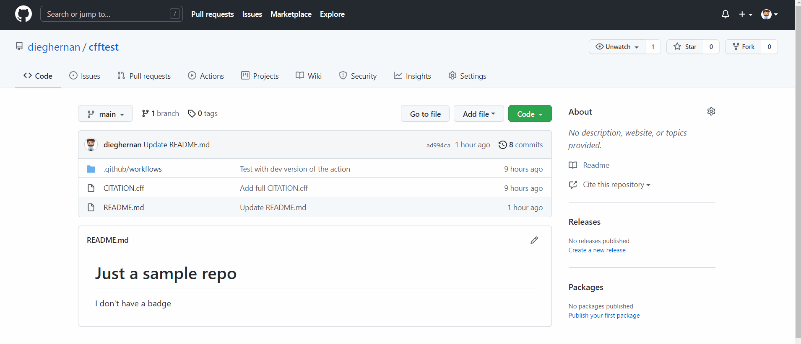

# cff-validator

 [](https://github.com/dieghernan/cff-validator/actions/workflows/cff-validator.yml) [](https://doi.org/10.5281/zenodo.5348443)

A GitHub action to validate `CITATION.cff` files with R.

## Introduction

If you have a [Citation File Format (cff)](https://citation-file-format.github.io) on your repository this action would check its validity against the defined [schema](https://github.com/citation-file-format/citation-file-format/blob/main/schema-guide.md).

A full valid workflow:

``` yaml
on:
  push:
    paths:
      - CITATION.cff
  workflow_dispatch:

name: CITATION.cff
jobs:
  Validate-CITATION-cff:
    runs-on: ubuntu-latest
    name: Validate CITATION.cff
    env:
      GITHUB_PAT: ${{ secrets.GITHUB_TOKEN }}

    steps:
      - name: Checkout
        uses: actions/checkout@v3

      - name: Validate CITATION.cff
        uses: dieghernan/cff-validator@main


```

On error, the action produces a Job Summary with a high-level description of the errors found:

<details><summary><strong>citation_cff_errors.md</strong></summary>


|field           |message                          |
|:---------------|:--------------------------------|
|data            |has additional properties        |
|data.authors.0  |no schemas match                 |
|data.doi        |referenced schema does not match |
|data.keywords.0 |is the wrong type                |
|data.license    |referenced schema does not match |
|data.url        |referenced schema does not match |


See [Guide to Citation File Format schema version 1.2.0](https://github.com/citation-file-format/citation-file-format/blob/main/schema-guide.md) for debugging.

</details>


For more examples, see the actions provided on [this path](https://github.com/dieghernan/cff-validator/tree/main/.github/workflows).

## Add a badge to your repo

You can easily create a badge showing the current status of validation of your `CITATION.cff` like this: 

[](https://github.com/dieghernan/cff-validator/actions/workflows/cff-validator.yml)

[](https://github.com/dieghernan/cff-validator/actions/workflows/cff-validator-error.yml)

See a quick demo:



## Inputs available

-   `citation-path`: Path to .cff file to be validated. By default it selects a `CITATION.cff` file on the root of the repository:

``` yaml
  - name: Validate CITATION.cff
    uses: dieghernan/cff-validator@main
    with:
      citation-path: "examples/CITATION.cff"
```

-   `cache-version`: default `1`. If you need to invalidate the existing cache pass any other number and a new cache will be used.

-   `install-r`: default `false`. If `true` download and install R during the setup. 
      If `false` use the existing installation in the GitHub Action image.

See a full featured implementation on [this example](https://github.com/dieghernan/cff-validator/blob/main/.github/workflows/cff-validator-complete-matrix.yml).

## For useRs

This action runs on R. For the same functionality
you can use the **cffr** package:

```r

cffr::cff_validate("CITATION.cff")
#> 
#> cff_validate results——
#> Congratulations! This .cff file is valid

```

See [`cffr::cff_validate()`](https://docs.ropensci.org/cffr/reference/cff_validate.html) for details.


## References

Druskat, S., Spaaks, J. H., Chue Hong, N., Haines, R., Baker, J., Bliven, S., Willighagen, E., Pérez-Suárez, D., & Konovalov, A. (2021). Citation File Format (Version 1.2.0) [Computer software]. <https://doi.org/10.5281/zenodo.5171937>
